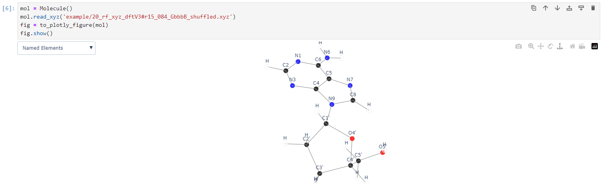

# xyz2atoms / 2024 python homework
Generates sequential numbering to atoms within a nucleotide and creates a plot using Plotly to visualize names/bond length/indexes.
Built upon xyz2graph.


## Installation
```
python -m pip install git+https://github.com/MelnychenkoM/xyz2atoms.git
```
## Requirements
- numpy
- pandas
- plotly